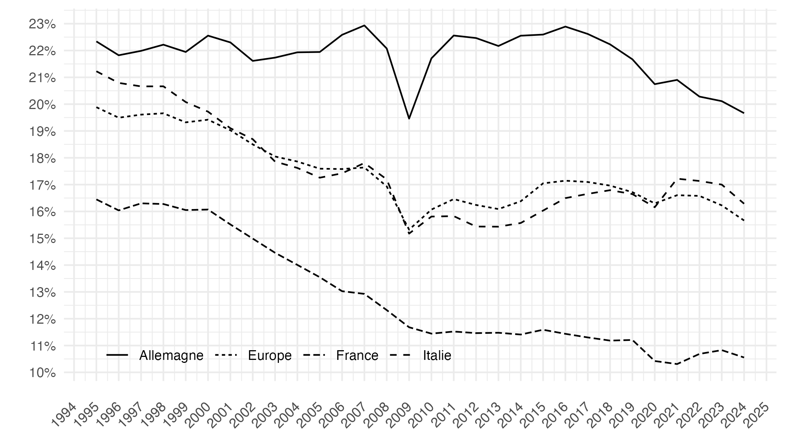
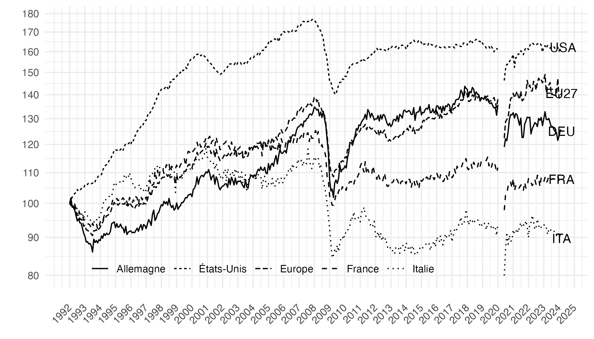
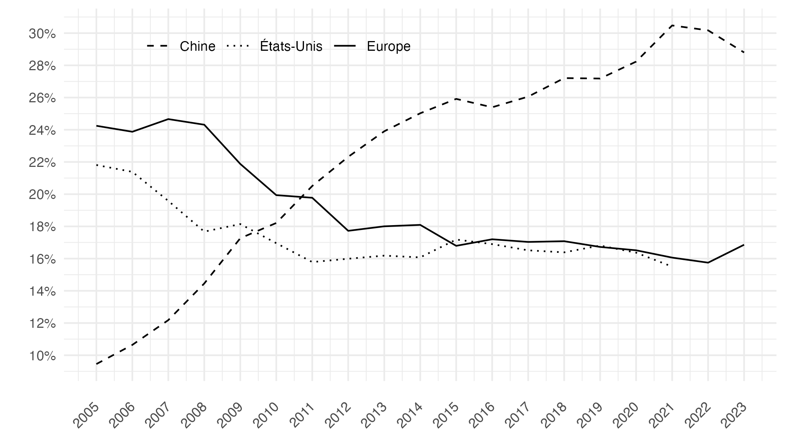

# Réindustrialisation : l’Union européenne et les nations

Ce dépôt met à disposition des codes de réplication pour les graphiques du chapitre dans l'Economie Européenne 2025 "Réindustrialisation : l’Union européenne et les nations".

## Graphique 1: Valeur ajoutée manufacturière (% du PIB)

[Code R](graphique1.R)

## Graphique 2: Indice de production industrielle (indice 100 = janvier 1992)

[Code R](graphique2.R)

## Graphique 3: Valeur ajoutée manufacturière (% de la VA mondiale)

[Code R](graphique3.R)

